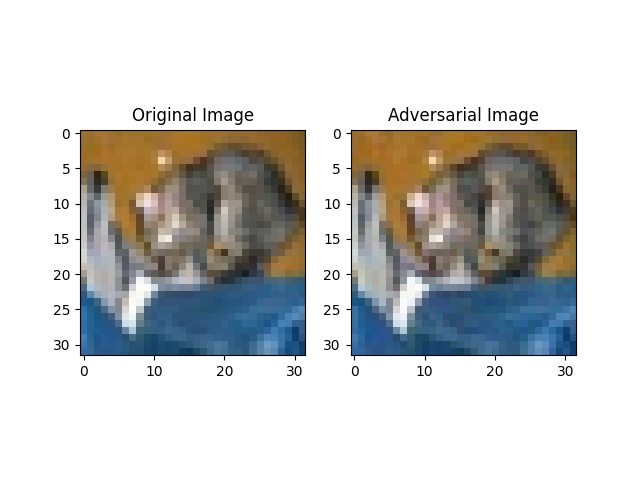

# Evaluating Transferability of Adversarial Attacks Across Machine Learning Models

This project benchmarks the cross-model transferability of adversarial attacks on convolutional neural networks trained on CIFAR-10. It investigates how well adversarial examples generated for one model architecture can deceive others, using standard attack methods.

## Overview

Adversarial attacks can cause machine learning models to misclassify inputs by applying small, imperceptible perturbations. A key concern is **transferability**—the ability of adversarial examples to fool models they were not explicitly crafted for.

This study evaluates three popular CNN architectures:
- ResNet-18
- VGG16
- MobileNetV2

We examine three major attack methods:
- Fast Gradient Sign Method (FGSM)
- Projected Gradient Descent (PGD)
- Carlini-Wagner (CW)

## Paper

**Title:** Evaluating Transferability of Adversarial Attacks Across Machine Learning Models  
**Author:** Jaiveer Bassi  
**Preprint:** [TechRxiv link pending]  
**Institution:** Grand Canyon University

## Key Findings

- All three attacks (FGSM, PGD, CW) exhibit near-complete transferability across models.
- Transfer success rates are frequently above 99% regardless of model architecture.
- This challenges the notion that iterative attacks are less transferable than simple one-step attacks.
- VGG16 showed slightly lower cross-architecture vulnerability compared to ResNet-18 and MobileNetV2.

## Experiment Setup

- **Dataset:** CIFAR-10
- **Models:** ResNet-18, VGG16, MobileNetV2 (all trained to ~90% test accuracy)
- **Attacks:** FGSM (ϵ=8/255), PGD (10 steps, α=2/255), CW (L2-norm variant)
- **Metrics:** Attack Success Rate (ASR), Transfer Success Rate (TSR)

## Results Summary

| Attack Type | Source Model  | Target Model | Transfer Success Rate (%) |
|-------------|----------------|----------------|----------------------------|
| FGSM        | ResNet-18 → MobileNetV2 | 99.93 |
| PGD         | VGG16 → MobileNetV2     | 99.90 |
| CW          | MobileNetV2 → ResNet-18 | 99.90 |

## Visual Example

The right image is perturbed but visually indistinguishable from the left original. Despite this, it causes incorrect predictions in multiple models.

## Implications

- Model architecture diversity alone is insufficient for defense.
- Transferability exposes systems to black-box attacks without requiring model access.
- Adversarial training and ensemble-based methods are essential for mitigating these risks.

## Future Work

- Extend to transformer and hybrid architectures
- Analyze targeted attack transferability
- Examine effect of adversarial training on cross-model robustness
- Explore shared feature vulnerabilities in latent space

## License

This research code and documentation are released under an open license for academic and non-commercial use. See `LICENSE` for details.
